# Introduction

This application serves as a demonstration of author's skills in building a [SOAP](https://www.w3.org/TR/soap/)-based API. 
Creating the application was a mandatory element of a semester-long course Distributed Systems and Service Integration 
conducted at the [Polish-Japanese Academy of Information Technology](https://www.pja.edu.pl/en/).

Having cloned the repository you can run the application locally and access it via the http://localhost:8080/ws/sharePrices.wsdl endpoint.

The API serves data on share prices from various exchanges around the world.

# Methods

Once started the service provides four share prices. For details consult the *src/main/java/edu/pja/plonca/sri/sharepricesoapws/DataInitializer.java*
file.

To test the methods listed below you can import the *sharePrices-soapui-project.xml* file into a tool like [SoapUI](https://www.soapui.org/).

## `addBulk`

Enable adding more than one share price at once. The result of sending the request on the left is three new entries:
* TSLA with index no. 5
* UBS with index no. 6
* AGL with index no. 7

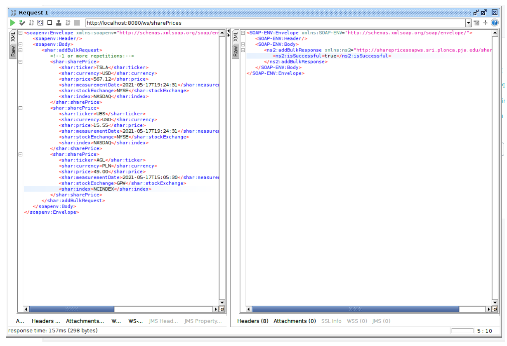

## `addSharePrice`

Enable adding a single share price. If saving the share price is successful, return the index of the entry.

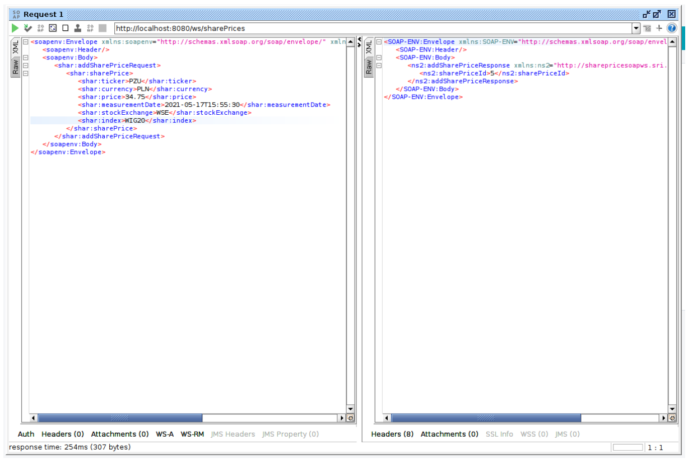

## `getLatestByTicker`

Get the latest quotation for a given ticker. 

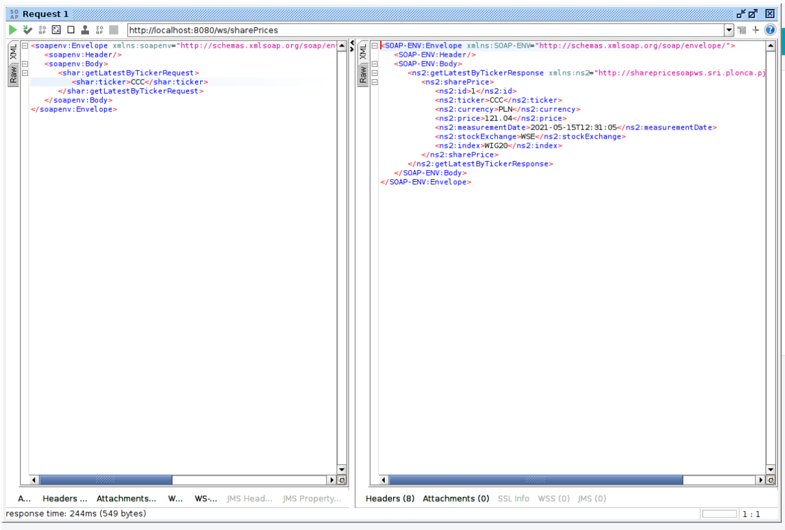

If there is no match, an empty response is returned.

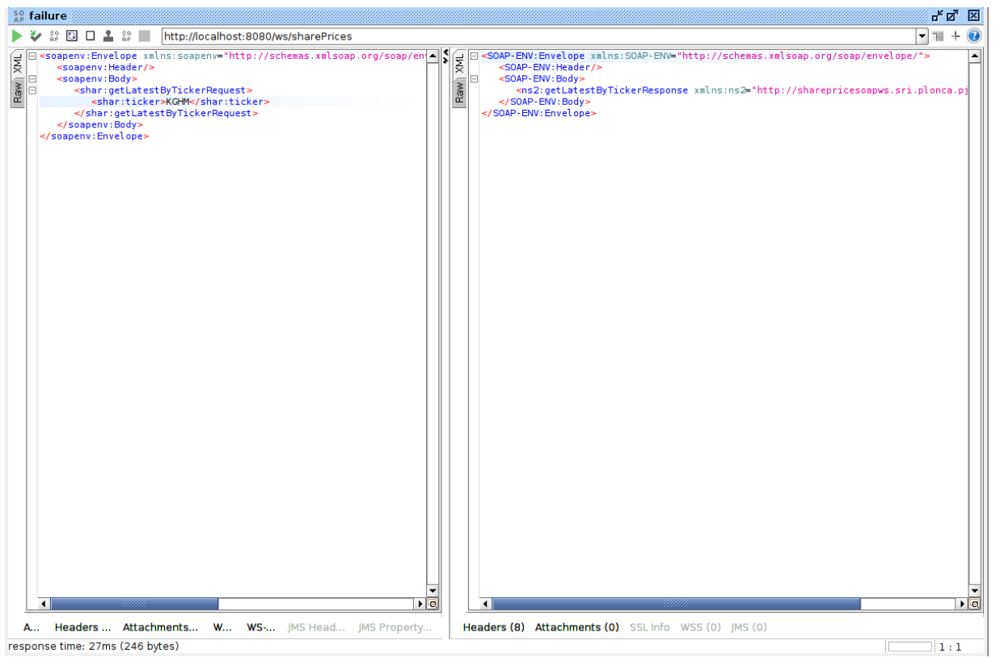

## `getMaxSharePriceByTickerAndBetweenMeasurementDateRequest`

Get the highest price given a ticker and a time span.

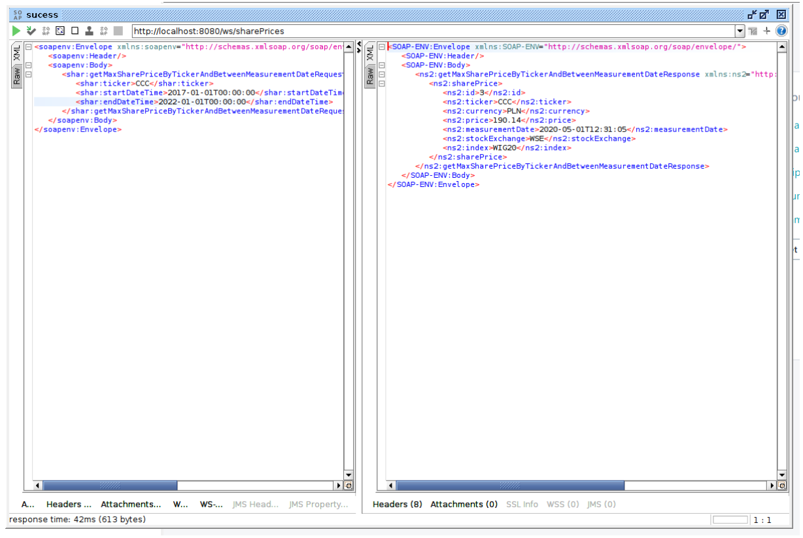

If there is no match, an empty response is returned.

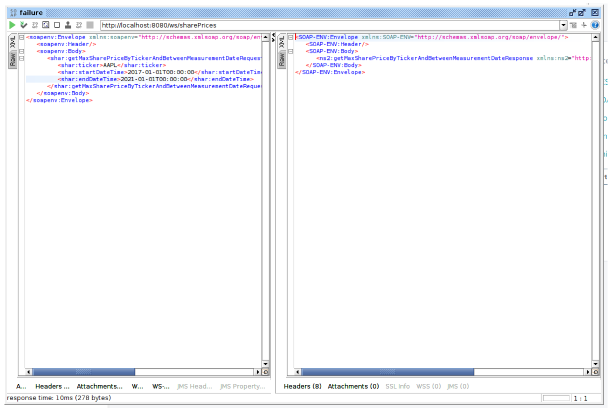

## `getSharePriceById`

Given an ID find the corresponding quotation.

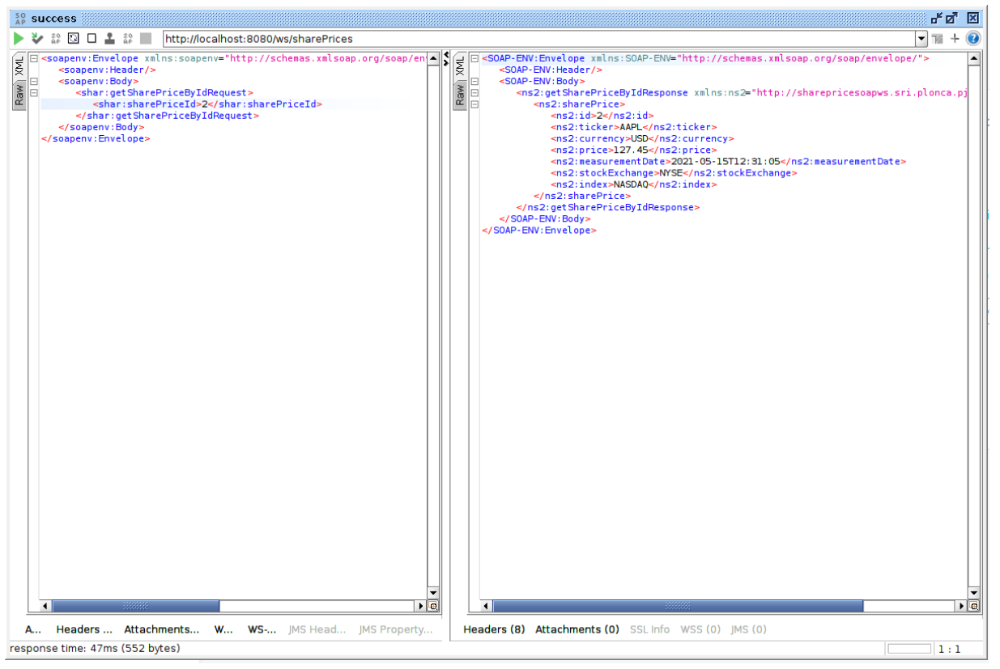

If there is no match, an empty response is returned.

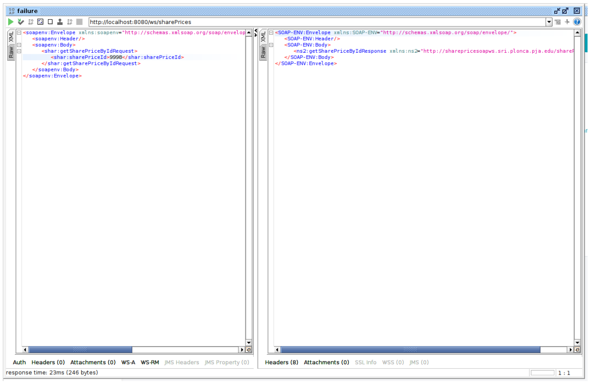

## `getSharePricesByStockExchange`

Get 0 or more quotations from a given stock exchange.

* multiple quotations:

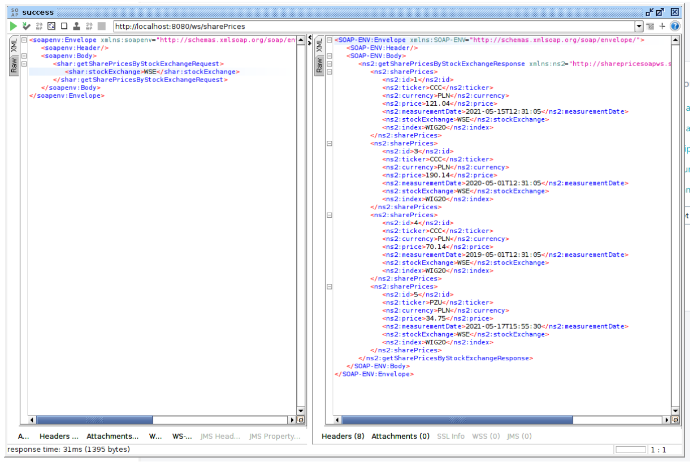

* single quotation:

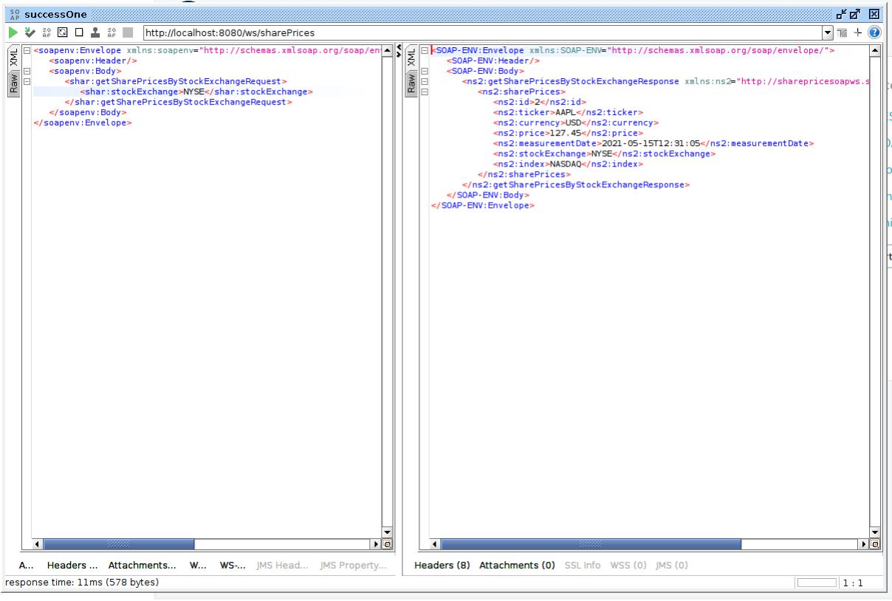

* no match:

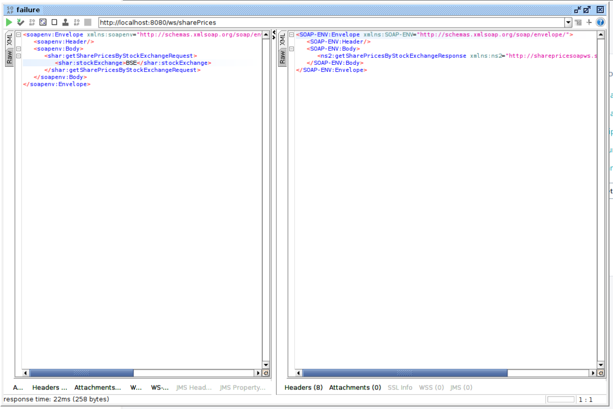

## `getSharePricesByTickerAndBetweenMeasurementDate`

Get all quotations for a given ticker from a given time span. Elements are sorted by `measurementDate` (ascending).

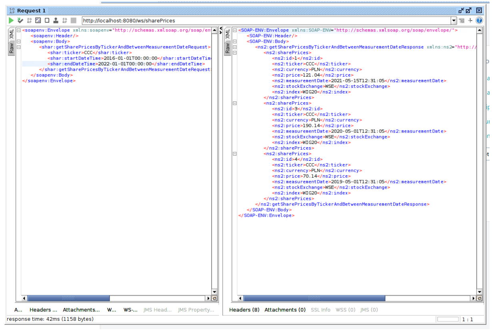

## `updateSharePrice`

Enable a full update (all fields) of a record. ID is required.

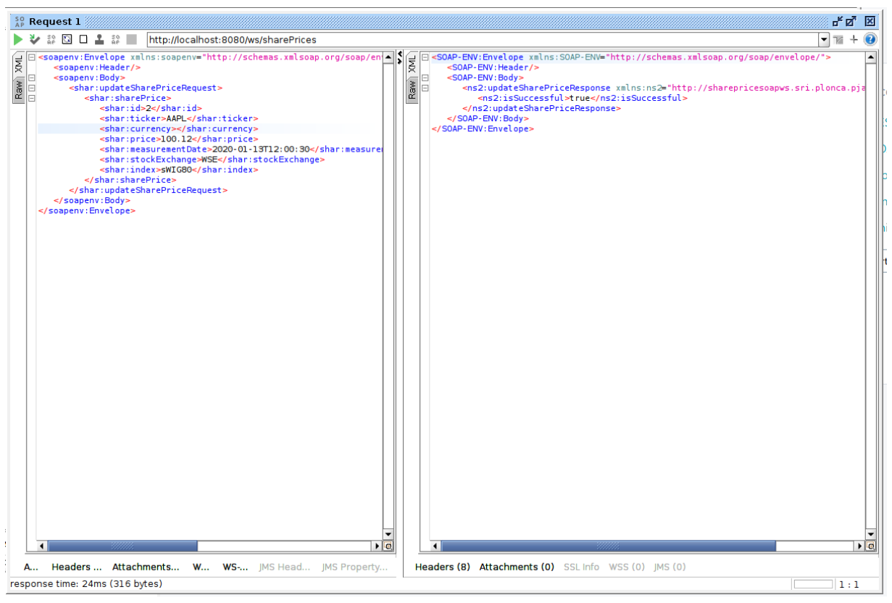
